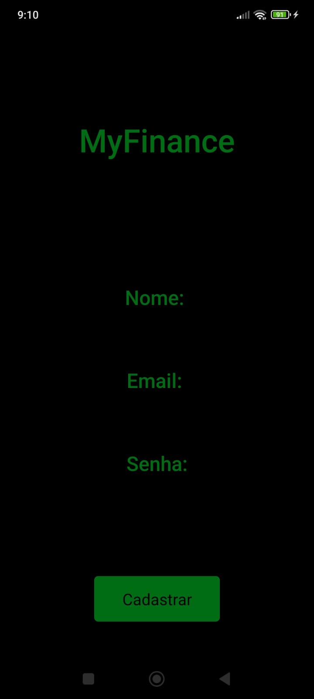
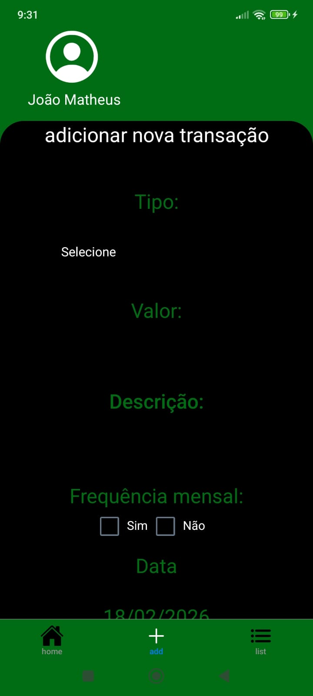
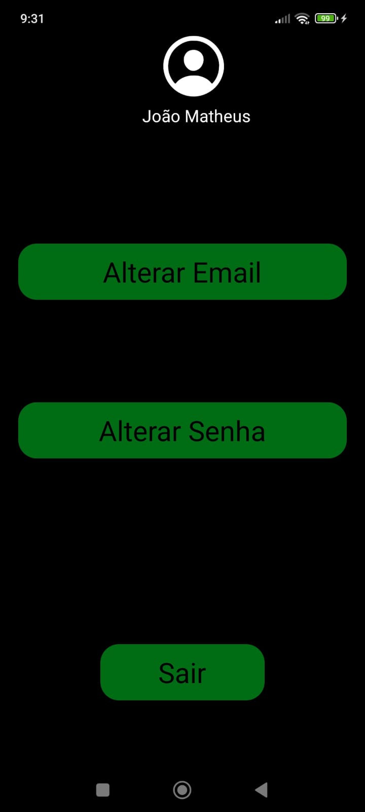

# My Finance App - Controle de Finanças Pessoais

Aplicativo mobile desenvolvido para organização de finanças pessoais, permitindo que o usuário acompanhe entradas, saídas e saldo mensal de forma prática e segura.
O projeto é dividido em:

🔹 Backend (API REST em Node.js)

🔹 Frontend (Aplicação Mobile com React Native)

## Objetivo do Projeto

- O objetivo do aplicativo é permitir que o usuário:

- Registrar entradas e saídas financeiras

- Acompanhar o saldo total

- Visualizar o andamento financeiro por mês

- Gerenciar conta com autenticação segura

- Manter os dados protegidos com token JWT

- Projeto desenvolvido com foco em:

- Organização de código

- Separação de responsabilidades

- Boas práticas de autenticação

- Estrutura escalável (padrão Controller + DAO)

# Demonstração do Aplicativo
## Telas

---
# Frontend
Aplicativo mobile desenvolvido com:

- **React Native**

- **Expo**

- Consumo de API via **fetch**

- Armazenamento seguro de token com SecureStore

- Navegação com Stack + Tabs

## Funcionalidades
- Cadastro e login de usuário

- Alteração de email e senha

- Registro de transações

- Cálculo automático de:
- Total de entradas
- Total de saídas
- Saldo mensal
- Atualização dinâmica dos dados

---

# Backend
API REST desenvolvida com:

- **Node.js**

- **MySQL**

- **JWT (Json Web Token)** para autenticação

- **Hash de senha (bcrypt)** para segurança

- Arquitetura organizada em camadas

## Segurança implementada

- Senhas criptografadas com hash

- Autenticação via token JWT

- Middleware para validação de rotas protegidas

- Armazenamento seguro do token no frontend

# Conceitos Aplicados
- API REST

- CRUD completo

- Autenticação JWT

- Middleware de proteção

- Hash de senha

- Arquitetura em camadas (Controller + DAO)

- Gerenciamento de estado com React Hooks

- Navegação estruturada com React Navigation

---

# Autor
Claudemir Junior

Estudante de Análise e Desenvolvimento de Sistemas